Welcome to, 

# Application Manual - Zinc Flake

Live link - [flZn Application Manual](https://znfl-coatings-manual-c99fa7fb2727.herokuapp.com/)


Homepage
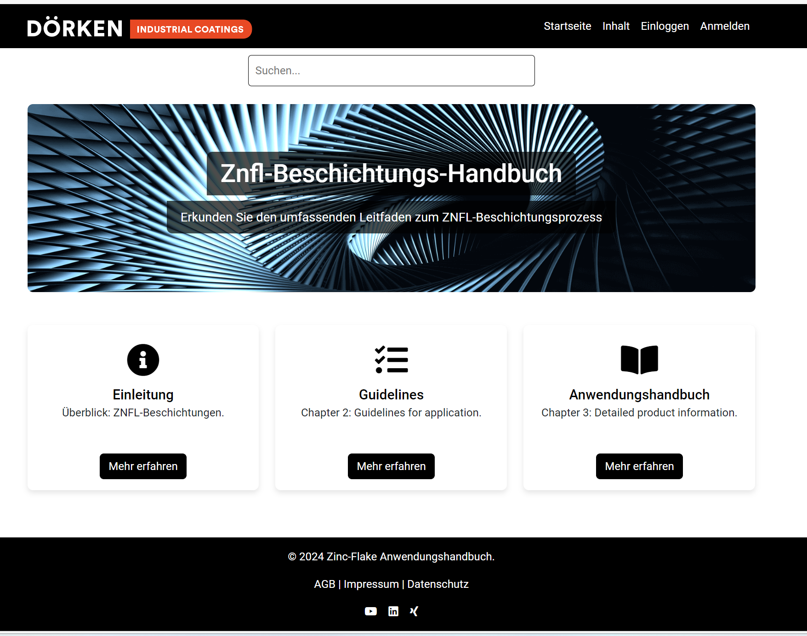

## Introduction

The manual includes the following: 
• Information and guidance on the zinc flake product portfolio; 
• Instructions for quality control of the systems

## Table of Contents

- [Project Goals](#project-goals)
- [User Experience - Jesse James Garrett's 5 Planes Model of UX](#user-experience-jesse-james-garret's-5-planes-of-ux)
- [Scope](#scope)
- [Design](#design)
- [Features](#features)
- [Technologies](#technologies-used)
- [Database Schema](#database-schema)
- [Testing](#testing)
- [Bugs](#bugs)
- [Deployment](#deployment)
- [Clone a repository code locally](#clone-a-repository-code-locally)
- [Forking in GitHub](#forking-in-github)
- [Credits](#credits)

## Project Goals

This application ensures that the transformation of the ZN-FL based products application manual into a web app not only meets current digital standards but also provides a superior user experience, leveraging the strengths of digital platforms to enhance accessibility, understanding, and application of the manual's contents.

- __User Goals__
    - Not only a resourceful manual but also as an interactive platform where users can engage with the content and each other, enhancing the overall UX.
    - Supports a more personalised and community-driven approach to content consumption and feedback.

- __Site Owner Goals__
    - The primary objective is to provide easy access to the application manual with enhanced navigability, searchability, and interactivity. 
    - Secondary objectives include offering updated information, and technical support.
  

## User Experience - Jesse James Garrett's 5 Planes Model of UX

- __Strategy  Layer__
- Site Owner Goals:
    - The primary objective is to provide easy access to the application manual with enhanced navigability, searchability, and interactivity. 
    - Secondary objectives include offering updated information, and technical support.
- User Goals:
    - Not only a resourceful manual but also as an interactive platform where users can engage with the content and each other, enhancing the overall UX.
    - Supports a more personalised and community-driven approach to content consumption and feedback. 

- __Scope Layer__
- Functional Requirements:
    - Search functionality to quickly find topics.
    - User accounts for saving favourites and comments.
    - Accessibility features, including screen reader compatibility, and alternative text for images.
- Content Requirements:
    - Conversion of the manual content into digital format, organized by chapters and sections as listed.
    - Addition of multimedia content for demonstration.
 
- __Structure Layer__
- Interaction Design:
    - Simplified navigation through a clear, hierarchical structure.
    - Responsive design to adapt to various devices and screen sizes.
    - Interactive elements such as dropdown menus for each product category, accordion panels for FAQs, and modals for quick tips.
- Information Architecture:
    - A logical grouping of content into categories and subcategories as per the manual's chapters.
    - A table of contents with hyperlinks for easy access to specific sections.
    - Breadcrumbs for easy tracking of user's position within the manual.
 
- __Skeleton Layer__
- Interface Design:
    - Clean and intuitive layout with a focus on readability (adequate font sizes and contrasts).
    - Consistent use of icons and colour coding to denote different sections or types of information.
- Navigation Design:
    - Fixed or sticky menu for the main navigation.
    - A back-to-top button for easy navigation on longer pages.
    - Search bar accessible from all pages.
- Information Design:
    - Use of charts, infographics, and bullet points to present complex information in an easily digestible format.
    - Tooltip explanations for technical terms or abbreviations.

- __Surface Layer__
- Visual Design:
    - Adherence to the brand’s colour scheme and typography to maintain consistency and brand recognition.
    - Use of whitespace to avoid clutter and focus attention on content.
    - High-quality images where necessary to demonstrate processes or end results.
 
- __Accessibility & Inclusivity__
- Visual Design:
    - Compliance with WCAG (Web Content Accessibility Guidelines) to cater to users with disabilities.
    - Text alternatives for non-text content, meaningful sequence, and navigation accessible through a keyboard.
    - Use ARIA (Accessible Rich Internet Applications) labels for interactive elements.
 

## Scope 
Epics, user stories, and acceptance criteria are written following agile development practices.
This structure helps in organising the development process, ensuring all user needs and business objectives are met systemtically. 

This document outlines the Epics, User Stories, and Tasks defined for our GitHub Projects board.

Board Link: [GitHub Projects Board](https://github.com/users/OSawani/projects/4)

## Epic 1: User Authentication and Registration
### User Story 1.1: User Registration
- **Task 1.1.1:** Create user registration form
- **Task 1.1.2:** Implement email confirmation upon registration
- **Task 1.1.3:** Admin panel for managing companies
- **Task 1.1.4:** Admin approves/rejects user accounts
- **Task 1.1.5:** Send email notifications for account approval

### User Story 1.2: User Login
- **Task 1.2.1:** Create login form
- **Task 1.2.2:** Display login status in the UI

### User Story 1.3: Password Reset
- **Task 1.3.1:** Implement password reset functionality using Django's built-in auth
- **Task 1.3.2:** Send password reset email with link

## Epic 2: Community Features and User Engagement
### User Story 2.1: Commenting System
- **Task 2.1.1:** Implement comment form and display comments
- **Task 2.1.2:** Allow users to edit/delete their comments
- **Task 2.1.3:** Automatic comment approval and future admin moderation

### User Story 2.2: Thumbs Up and Favorites
- **Task 2.2.1:** Implement thumbs up feature
- **Task 2.2.2:** Save liked content to user favorites
- **Task 2.2.3:** Remove thumbs up and from favorites

## Epic 3: Content Management and Version Control
### User Story 3.1: Content Editing and Deletion
- **Task 3.1.1:** Implement content editing functionality
- **Task 3.1.2:** Implement content deletion functionality
- **Task 3.1.3:** Save changes and manage drafts

### User Story 3.2: Version Control
- **Task 3.2.1:** Implement version control for content
- **Task 3.2.2:** Display version history and compare changes
- **Task 3.2.3:** Notify users about new versions

## Epic 4: Notifications and Alerts
### User Story 4.1: Account Approval Notifications
- **Task 4.1.1:** Send email notifications for account approval

### User Story 4.2: Content Update Notifications
- **Task 4.2.1:** Send email notifications for content updates
- **Task 4.2.2:** Link to version-specific update page

## Epic 5: Search Functionality
### User Story 5.1: Search Content
- **Task 5.1.1:** Implement search bar
- **Task 5.1.2:** Display search results grouped by chapters
- **Task 5.1.3:** Highlight matched keywords in results

The development of the web app is user-focused, prioritising ease of access, interaction, and continuous improvement based on user feedback. 


[Back to Table of Contents](#table-of-contents)

## Design

- __Design Choices__
    - The corporate design colour scheme of Zinc Flake Coatings was used as the primary colour palette for the website.

- __Typography__
    - The website uses the Roboto font family for a clean and modern look, ensuring readability across different devices and screen sizes.

- __Wireframes__
    - The wireframes were created using Figma to visualise the layout and structure of the website, including the home page, manual sections, and user profile.

### Screenshots of Wireframes
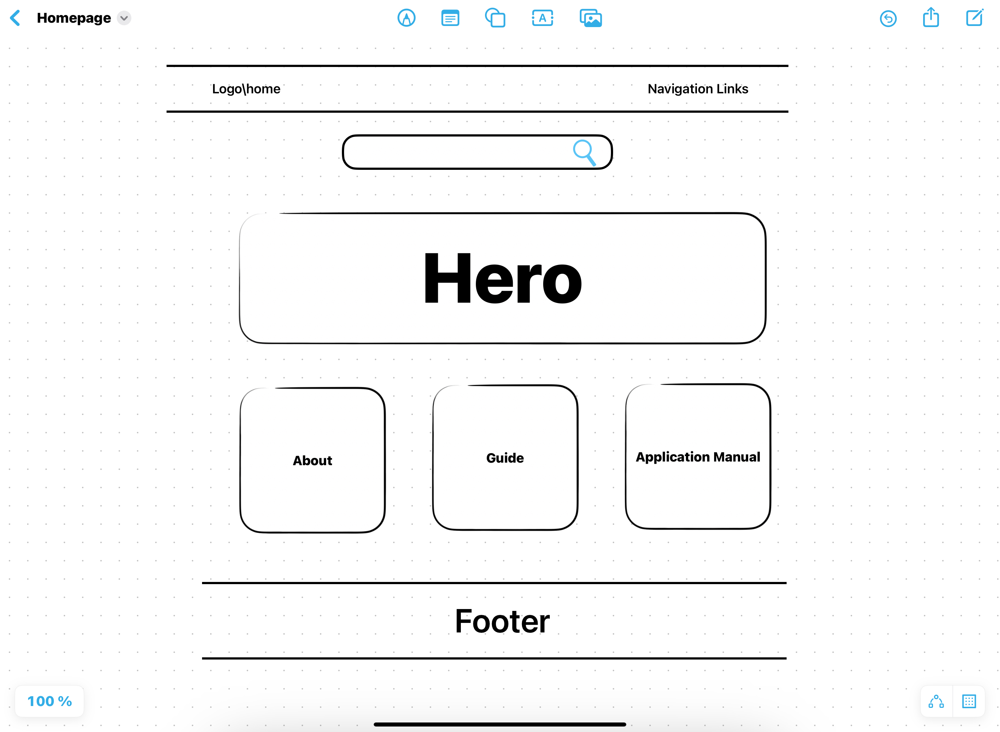
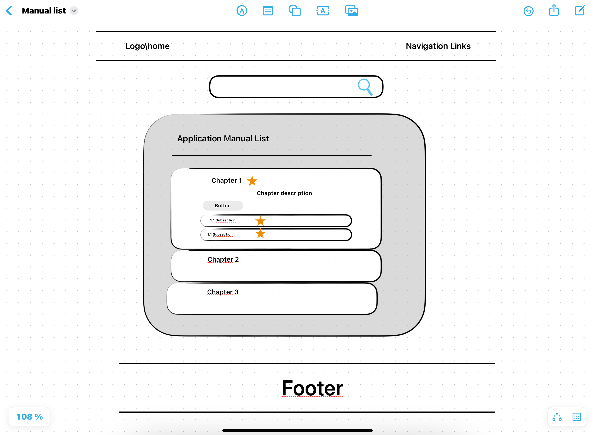

[Back to Table of Contents](#table-of-contents)

## Features

#### Home Screen
The main entry point of the application providing an overview of the website's purpose and quick access to various sections.


#### About Screen
A dedicated page that gives detailed information about the website, its creators, and its mission.
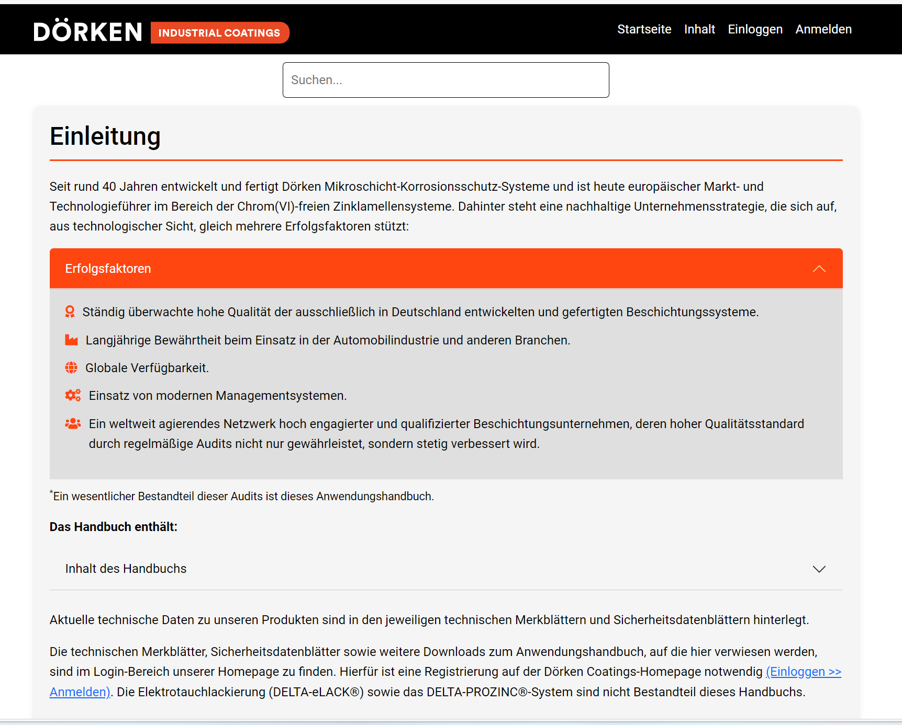


#### Manual Screen
Displays the comprehensive manual content, organized into sections and subsections for easy navigation with the ability to add to favourites.
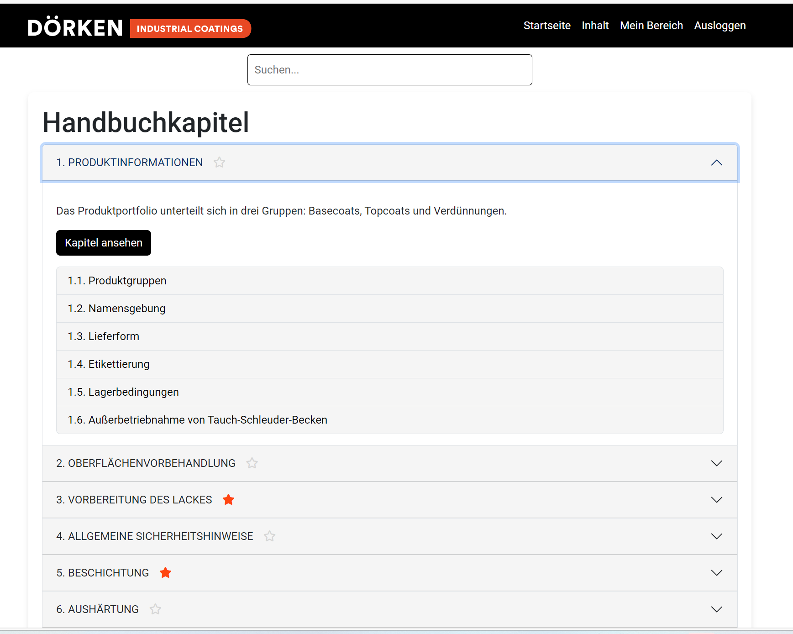


#### Section Details Screen
Shows detailed information about a specific section, including content, comments, and related subsections.
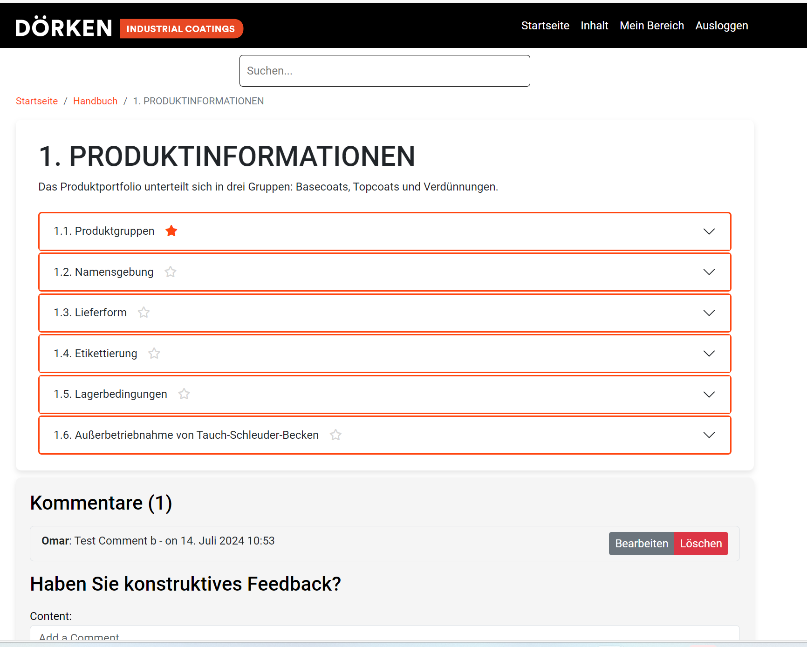


#### Responsive Design Example
Illustrates how the website adjusts seamlessly to different screen sizes and devices, ensuring a consistent user experience.
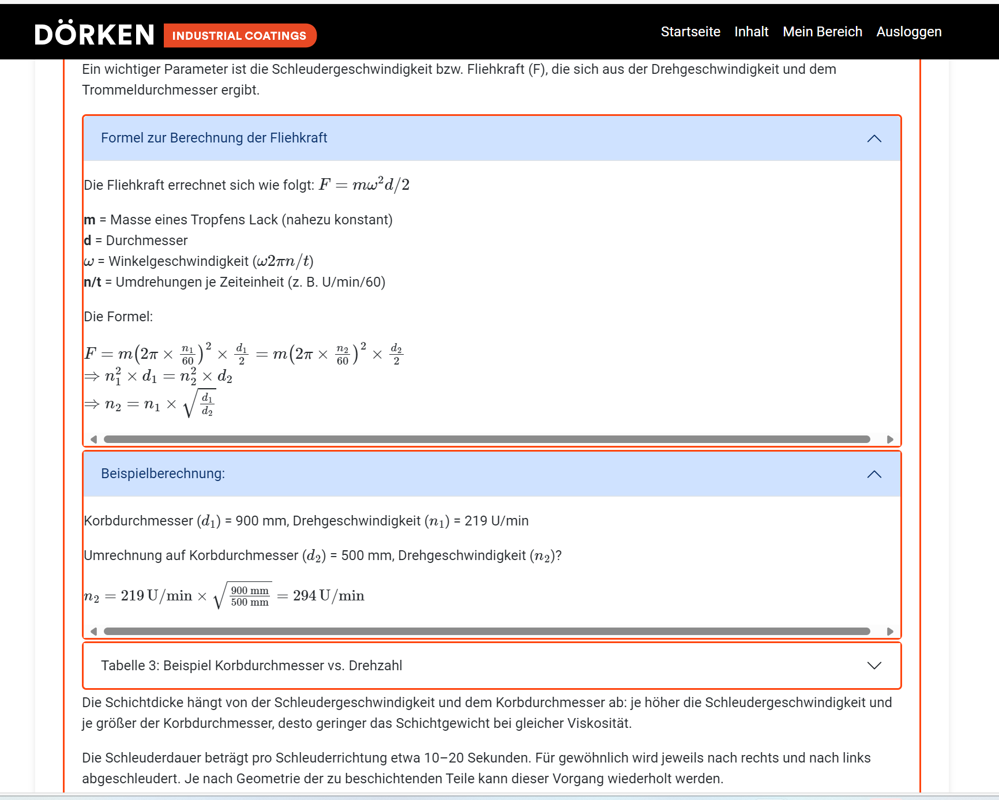
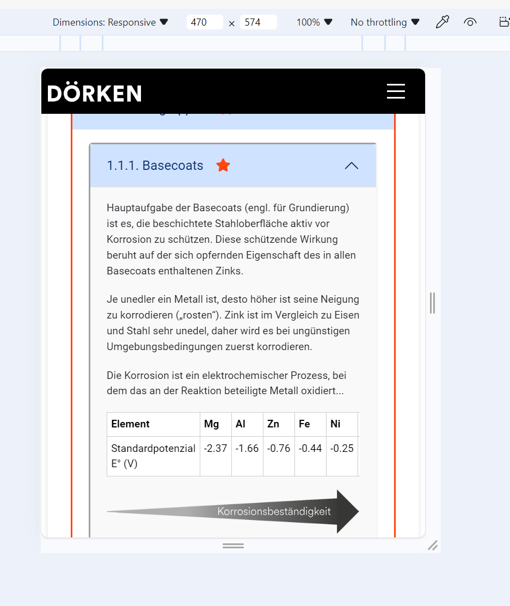


#### Search Functionality
Allows users to quickly find specific content within the manual by entering keywords or phrases.
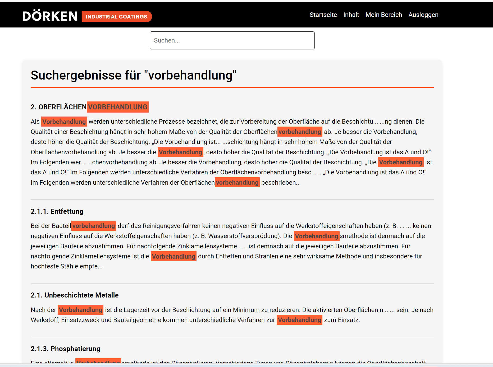

#### Dashboard
A user dashboard displaying user-specific information, including favourites, comments.
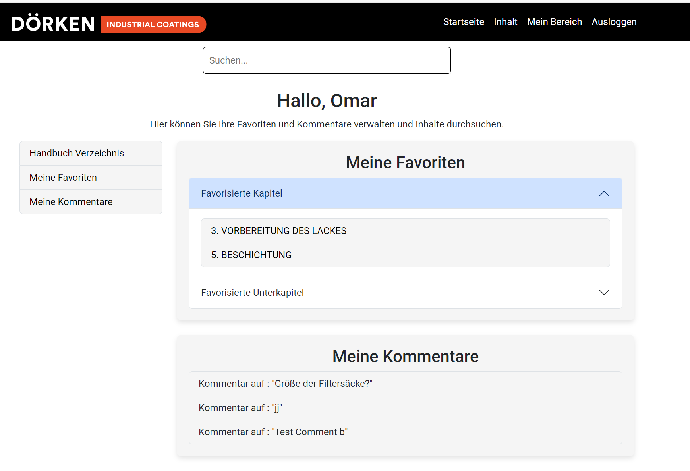


[Back to Table of Contents](#table-of-contents)

### __Technologies Used__

- Python: The primary language for game development.
- Bootstrap & Django: Used for the front-end design and back-end development.
- GitHub: Used to store and manage the project's code.
- PyCharm: The integrated development environment for coding and version control.
- Git: Employed for version control via the VSCode terminal.
- Heroku: Platform for deploying and managing the application.

[Back to Table of Contents](#table-of-contents)

### __Database Schema__ Models Overview

The project consists of three apps: core, manual, and interactions. Each app contains several models that define the data schema. Below is a comprehensive description of each model, including their fields, relationships, cascading behaviors, constraints, and triggers.


The project consists of three apps: core, manual, and interactions. Each app contains several models that define the data schema. Below is a comprehensive description of each model, including their fields, relationships, cascading behaviors, constraints, and triggers.

#### Core Models

##### 1. Company

The Company model represents a company with a unique name.

###### Fields:
- **name (CharField)**: The name of the company (max_length=255, unique=True).
- **created_at (DateTimeField)**: The date and time when the company was created (auto_now_add=True).
- **updated_at (DateTimeField)**: The date and time when the company was last updated (auto_now=True).

###### Relationships:
- **One-to-Many with User (related_name='employees')**: A company can have many employees.

##### 2. User

The User model extends the default Django AbstractUser model, using email as the username field and including additional fields.

###### Fields:
- **first_name (CharField)**: The first name of the user (max_length=100).
- **last_name (CharField)**: The last name of the user (max_length=100).
- **email (EmailField)**: The unique email address of the user (unique=True).
- **is_approved (BooleanField)**: The approval status of the user (default=False).
- **company (ForeignKey to Company)**: The company to which the user belongs (on_delete=models.SET_NULL, null=True, blank=True, related_name='employees').
- **created_at (DateTimeField)**: The date and time when the user was created (auto_now_add=True).
- **updated_at (DateTimeField)**: The date and time when the user was last updated (auto_now=True).
- **groups (ManyToManyField to auth.Group)**: The groups this user belongs to (related_name='custom_user_set', blank=True).
- **user_permissions (ManyToManyField to auth.Permission)**: Specific permissions for this user (related_name='custom_user_permissions_set', blank=True).

###### Relationships:
- **Many-to-One with Company (related_name='employees')**: Many users can belong to one company.
- **Many-to-Many with auth.Group (related_name='custom_user_set')**: A user can belong to many groups.
- **Many-to-Many with auth.Permission (related_name='custom_user_permissions_set')**: A user can have many permissions.

###### Triggers:
- **send_approval_email()**: Sends an approval email to the user notifying them that their account has been approved.

#### Manual Models

##### 1. Section

The Section model represents a section with a title, description, author, and timestamps.

##### Fields:
- **title (CharField)**: The title of the section (max_length=255).
- **description (TextField)**: The description of the section (null=True, blank=True).
- **author (ForeignKey to core.User)**: The author of the section (on_delete=models.SET_NULL, null=True, blank=True, related_name='sections').
- **created_at (DateTimeField)**: The date and time when the section was created (auto_now_add=True).
- **updated_at (DateTimeField)**: The date and time when the section was last updated (auto_now=True).
- **css_path (CharField)**: The path to the CSS file for the section (null=True, blank=True).

##### Relationships:
- **One-to-Many with Subsection (related_name='sub_sections', on_delete=models.CASCADE)**: A section can have many subsections.
- **One-to-Many with ContentVersion (related_name='versions', on_delete=models.CASCADE)**: A section can have many content versions.
- **One-to-Many with Comment (related_name='comments', on_delete=models.CASCADE)**: A section can have many comments.
- **Many-to-Many with Favourite (related_name='favourites')**: A section can be favourited by many users.

##### Constraints:
- Unique constraint on title.

##### 2. Subsection

The Subsection model represents a subsection within a section, with a possible parent subsection, author, title, content, and timestamps.

##### Fields:
- **section (ForeignKey to Section)**: The section to which this subsection belongs (on_delete=models.CASCADE, related_name='sub_sections').
- **parent (ForeignKey to self)**: The parent subsection of this subsection (null=True, blank=True, on_delete=models.CASCADE, related_name='sub_sections').
- **author (ForeignKey to core.User)**: The author of the subsection (on_delete=models.SET_NULL, null=True, blank=True, related_name='sub_sections').
- **title (CharField)**: The title of the subsection (max_length=255).
- **content (TextField)**: The content of the subsection (null=True, blank=True).
- **created_at (DateTimeField)**: The date and time when the subsection was created (auto_now_add=True).
- **updated_at (DateTimeField)**: The date and time when the subsection was last updated (auto_now=True).

##### Relationships:
- **Many-to-One with Section (related_name='sub_sections')**: Many subsections can belong to one section.
- **Many-to-One with self (related_name='sub_sections')**: Many subsections can have a parent subsection.
- **One-to-Many with ContentVersion (related_name='versions', on_delete=models.CASCADE)**: A subsection can have many content versions.
- **One-to-Many with Comment (related_name='comments', on_delete=models.CASCADE)**: A subsection can have many comments.
- **Many-to-Many with Favourite (related_name='favourites')**: A subsection can be favourited by many users.

##### Constraints:
- Unique constraint on title within the same section.

##### Triggers:
- **save()**: Cleans HTML content before saving the subsection.

##### 3. ContentVersion

The ContentVersion model represents a version of content within a subsection, including the version number, content, author, and timestamps.

##### Fields:
- **subsection (ForeignKey to Subsection)**: The subsection to which this version belongs (on_delete=models.CASCADE, related_name='versions').
- **section (ForeignKey to Section)**: The section to which this version belongs (on_delete=models.CASCADE, null=True, blank=True, related_name='versions').
- **version_number (IntegerField)**: The version number of the content.
- **content (TextField)**: The content of the version.
- **author (ForeignKey to core.User)**: The author of the content version (on_delete=models.SET_NULL, null=True, blank=True, related_name='published_versions').
- **created_at (DateTimeField)**: The date and time when the content version was created (auto_now_add=True).
- **updated_at (DateTimeField)**: The date and time when the content version was last updated (auto_now=True).

##### Relationships:
- **Many-to-One with Subsection (related_name='versions')**: Many content versions can belong to one subsection.
- **Many-to-One with Section (related_name='versions')**: Many content versions can belong to one section.

##### Constraints:
- Unique constraint on version_number within the same subsection.

#### Interactions Models

##### 1. Comment

The Comment model represents a comment made by a user on a section or subsection, including the content, approval status, and timestamps.

##### Fields:
- **user (ForeignKey to core.User)**: The user who made the comment (on_delete=models.CASCADE).
- **section (ForeignKey to manual.Section)**: The section the comment is related to (on_delete=models.CASCADE, null=True, blank=True, related_name='comments').
- **subsection (ForeignKey to manual.Subsection)**: The subsection the comment is related to (on_delete=models.CASCADE, null=True, blank=True, related_name='comments').
- **content (TextField)**: The content of the comment.
- **approved (BooleanField)**: The approval status of the comment (default=True).
- **created_at (DateTimeField)**: The date and time when the comment was created (auto_now_add=True).
- **updated_at (DateTimeField)**: The date and time when the comment was last updated (auto_now=True).

##### Relationships:
- **Many-to-One with User (related_name='comments')**: Many comments can be made by one user.
- **Many-to-One with Section (related_name='comments')**: Many comments can be related to one section.
- **Many-to-One with Subsection (related_name='comments')**: Many comments can be related to one subsection.

##### Constraints:
- None.

##### 2. Favourite

The Favourite model represents a user's favourite section or subsection, including timestamps.

##### Fields:
- **user (ForeignKey to core.User)**: The user who favourited the section or subsection (on_delete=models.CASCADE, related_name='favourites').
- **section (ForeignKey to manual.Section)**: The section that was favourited (null=True, blank=True, on_delete=models.CASCADE, related_name='favourites').
- **subsection (ForeignKey to manual.Subsection)**: The subsection that was favourited (null=True, blank=True, on_delete=models.CASCADE, related_name='favourites').
- **created_at (DateTimeField)**: The date and time when the favourite was created (auto_now_add=True).
- **updated_at (DateTimeField)**: The date and time when the favourite was last updated (auto_now=True).

##### Relationships:
- **Many-to-One with User (related_name='favourites')**: Many favourites can be created by one user.
- **Many-to-One with Section (related_name='favourites')**: Many favourites can be related to one section.
- **Many-to-One with Subsection (related_name='favourites')**: Many favourites can be related to one subsection.

##### Constraints:
- Unique constraint on the combination of user and section.
- Unique constraint on the combination of user and subsection.

##### 3. Notification

The Notification model represents a notification sent to a user, including the type, message, send status, and timestamps.

##### Fields:
- **user (ForeignKey to core.User)**: The user who receives the notification (on_delete=models.CASCADE, related_name='notifications').
- **type (CharField)**: The type of notification (max_length=100).
- **message (TextField)**: The message content of the notification.
- **sent (BooleanField)**: The send status of the notification (default=False).
- **created_at (DateTimeField)**: The date and time when the notification was created (auto_now_add=True).
- **updated_at (DateTimeField)**: The date and time when the notification was last updated (auto_now=True).

##### Relationships:
- **Many-to-One with User (related_name='notifications')**: Many notifications can be sent to one user.

##### Constraints:
- None.


[Back to Table of Contents](#table-ofcontents)


## Testing

#### Automated Testing

This project includes a comprehensive suite of automated and manual tests to ensure the website’s functionality, usability, and responsiveness. Below is a summary of the implemented tests and their purpose.

##### Test Suite

###### Form Tests

- **CommentForm Tests**: Validate the content field of the comment form.
  - `test_form_is_valid`: Ensures that the form is valid with correct data.
  - `test_form_is_invalid`: Ensures that the form is invalid with empty data.

###### Views Tests

- **TestInteractionsViews**: Test views related to comments on sections.
  - `setUp`: Sets up a test user, company, section, and mock email verification.
  - `test_add_comment_to_section`: Tests adding a comment to a section.
  - `test_edit_comment`: Tests editing a comment on a section.
  - `test_delete_comment`: Tests deleting a comment from a section.

###### Testing Procedures

1. **Setup**: Each test case sets up the necessary data, including creating a test user with a verified email and a test section for comments.
2. **Execution**: The tests simulate user actions such as adding, editing, and deleting comments through the corresponding views.
3. **Validation**: After performing the actions, the tests validate the expected outcomes using assertions to ensure data integrity and correct application behavior.

###### Running Tests

To run the tests, use the following command:

```sh
python manage.py test --keepdb
```
###### Results
1. Form validations are enforced as expected.
2. Users can add, edit, and delete comments on sections if they are verified and approved.
3. The application handles user authentication and permissions properly for comment-related actions.

Screenshot of the test results: 
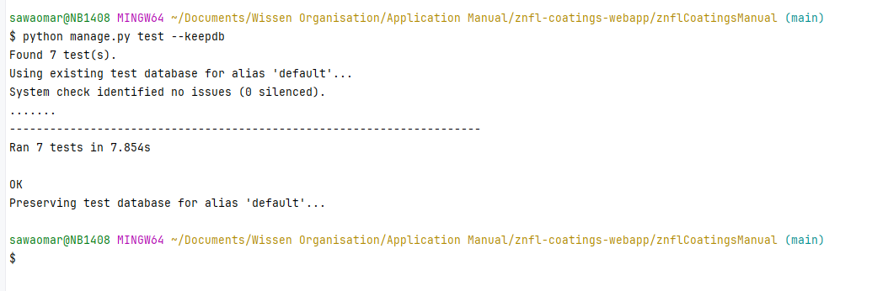

#### Manual Testing

##### Manual Test Procedures with Expected and Actual Outcomes
###### Functionality
1. User Registration and Login:
New users can register with valid details and receive verification emails.
Users can log in with valid credentials.

2. Email Verification:
Email verification process by registering a new user and following the verification link sent via email works.
Unverified users cannot add comments.

3. User Approval:
Users need admin approval to add comments.
Admin interface approves users and ensure the status updates correctly.

###### Usability
1. Navigation:
Manually navigating through the website ensures all links and buttons work correctly.
Responsiveness of the navigation menu on different devices and screen sizes is tested.

2. Form Interactions:
All forms tested for proper input validation and error handling.
Form submissions provide appropriate success and error messages.

###### Responsiveness
1. Responsive Design:
Manually resizing the browser window ensures the layout on different screen sizes (mobile, tablet, desktop) scales.
Using browser developer tools to simulate different device viewports ensures the UI adjusts correctly.

2. Cross-Browser Compatibility:
Tested the website on multiple browsers (Chrome, Firefox, Edge) to ensure consistent behavior and appearance.

###### Data Management
1. Database Integrity:
Verified that data is correctly saved to the database by performing actions like adding, editing, and deleting comments, and then checking the database records.
Ensured that deleting a user cascades correctly and associated data (like comments) is handled properly.

2. Error Handling:
Manually triggered errors (e.g., invalid form submissions, unauthorized actions) to verify that the application handles them gracefully, providing user-friendly error messages.

#### Python Validation 

- All Python modules were thoroughly tested and validated using CI Python linters to ensure code quality and adherence to Pythonic conventions PEP8.
- Errors were all related to four main issues, trailing white spaces, line length, indentation levels and spaces around keyword/parameter "="

Screenshots:

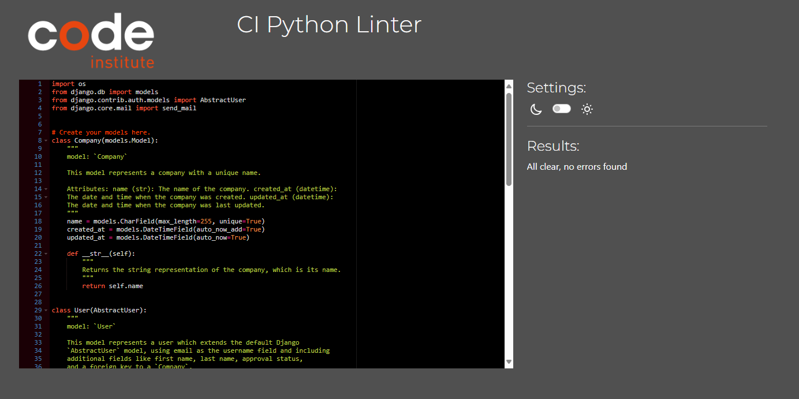
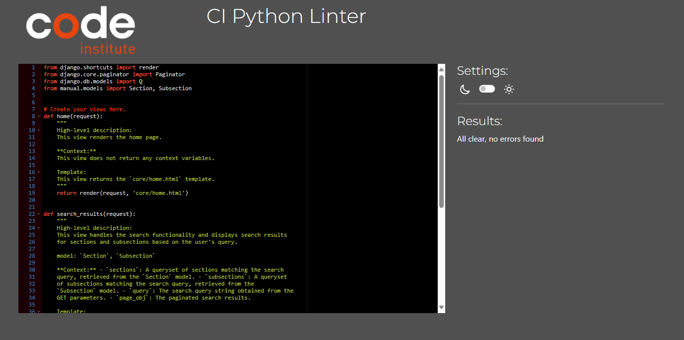
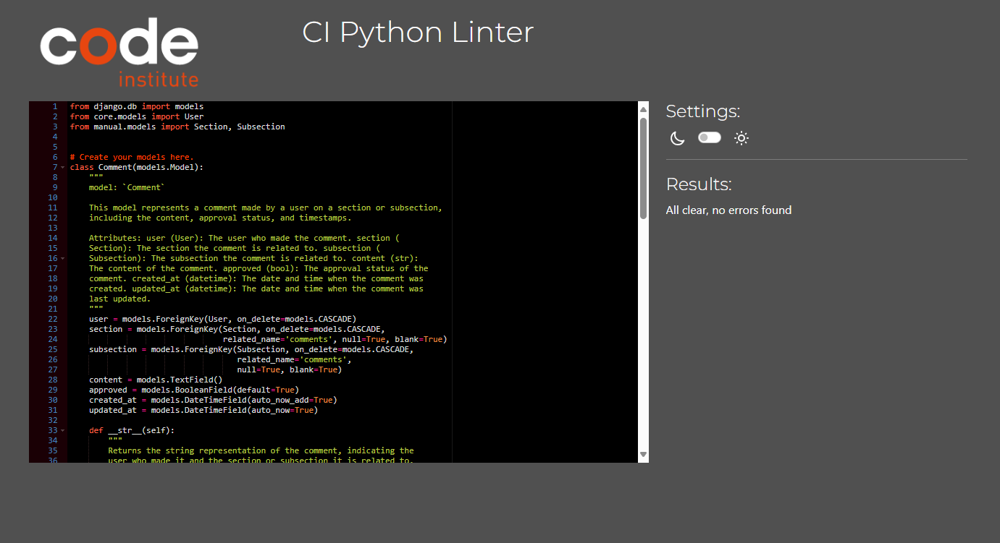
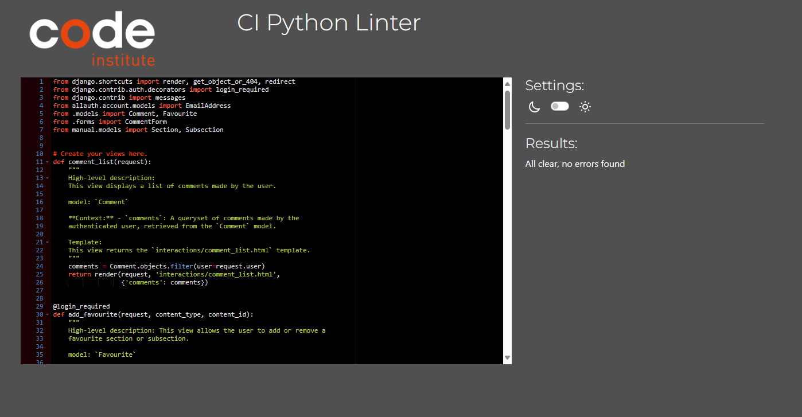
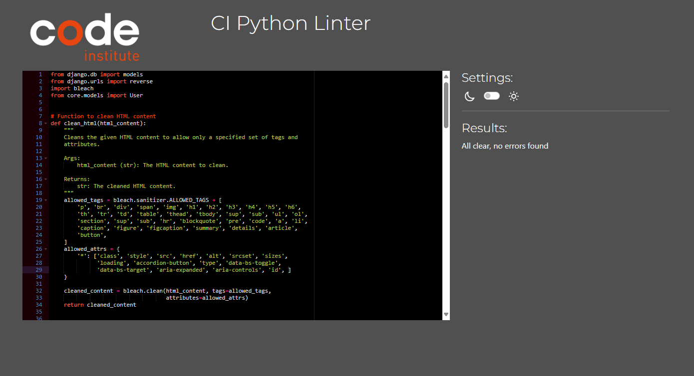
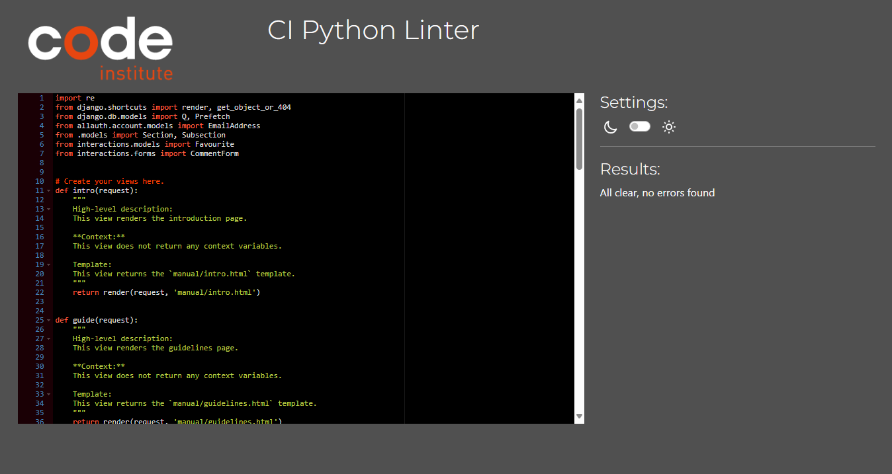

##### E501 line too long (117 > 79 characters)
- **Cause:** Lines exceeding the maximum recommended length of 79 characters, affecting readability.
- **Solution:** Broke long lines into shorter ones using parentheses, line continuation character `\`, and reformatting.

#### HTML Validation 
Screenshot:
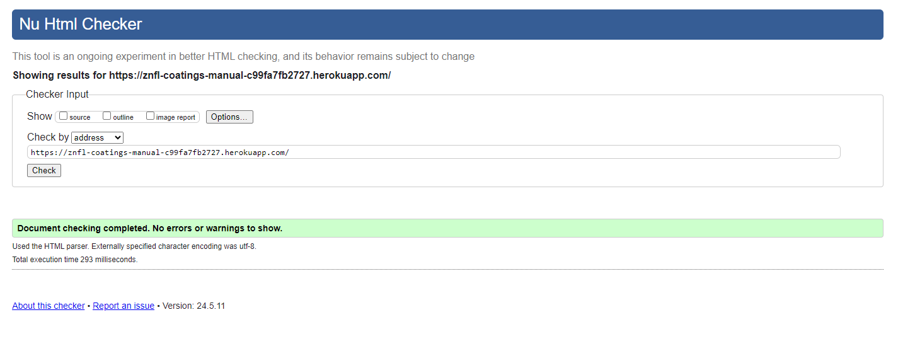
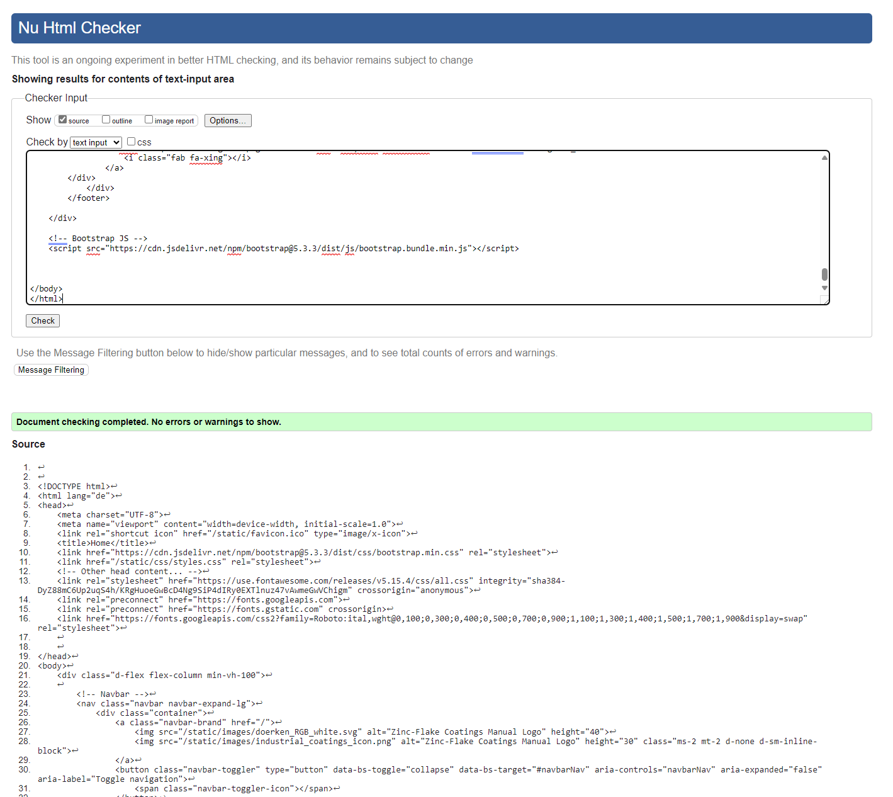


#### CSS Validation 
Screenshot: 
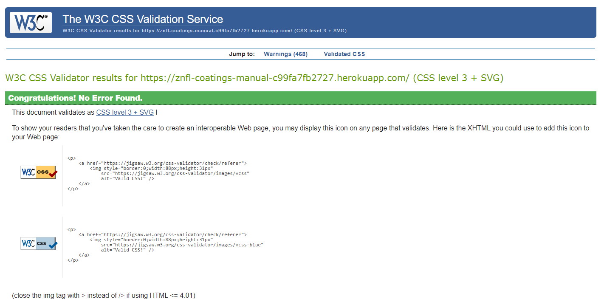

#### JS Validation 
Screenshot:
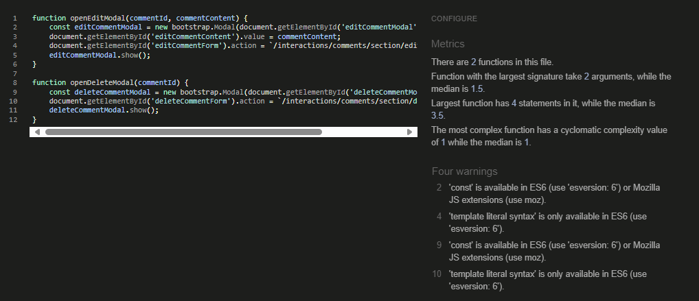
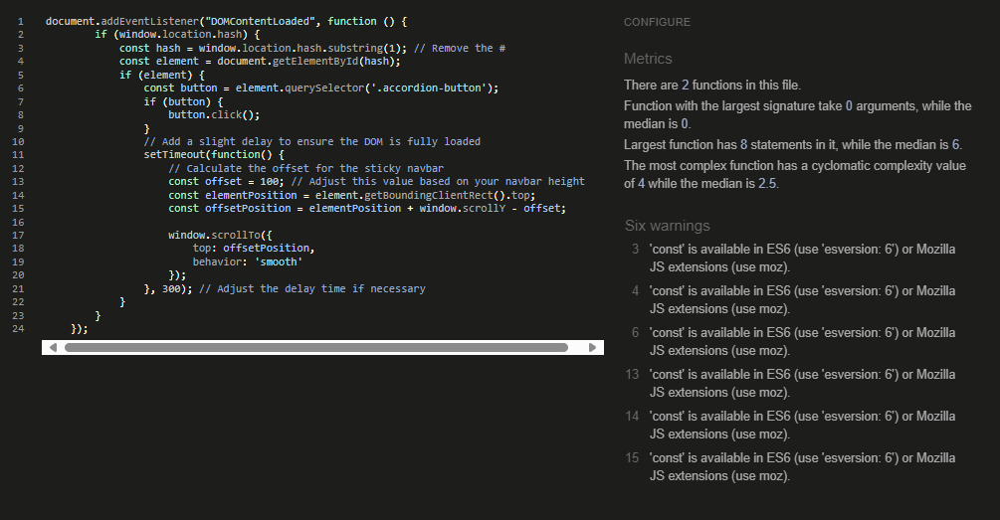

#### Lighthouse Report 
Screenshot:
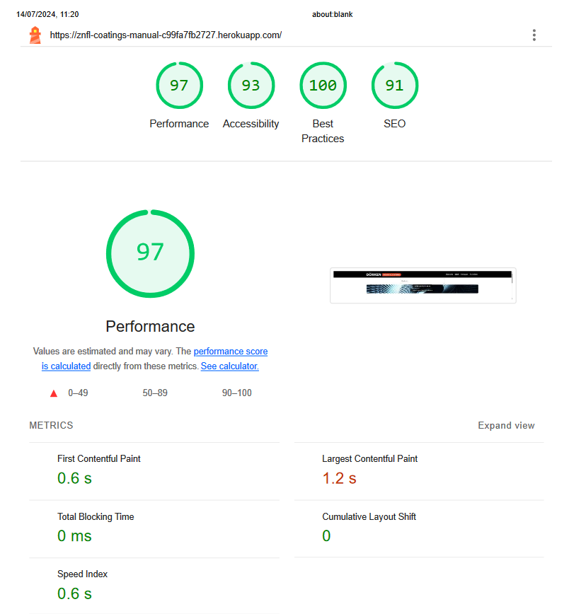


[Back to Table of Contents](#table-of-contents)


[Back to Table of Contents](#table-of-contents)

## Bugs
 Throughout the development process, several bugs were encountered and resolved. Below is a list of notable bugs and their resolutions:

### Resolved bugs:
#### Custom User Model: both auth.User and core.User (my custom user model) try to create the same reverse accessors (user_set), leading to a conflict.
#### Solution: to avoid these conflicts, I provided unique related_name attributes for the groups and user_permissions fields in my custom User model.

#### RichTextField was not rendering correctly in the Django admin panel.
#### Solution: switching to TextField resolved your issue by avoiding the custom handling and sanitization mechanisms of SummernoteTextField. This change allowed for more predictable and direct handling of HTML content, reducing the risk of unwanted alterations and escaping. By manually controlling sanitization and rendering, you ensure that the content is stored and displayed as intended.

#### Lexicographical ordering: the default behavior for string sorting. When sorting strings, "10" comes after "1" because "1" is compared first and it appears before "10" lexicographically.
#### Solution: implemented natural sorting, which sorts numbers within strings as numerical values rather than strings  

#### Performance issues: Heroku had a 30-second timeout for requests, and the application was taking longer to process and respond. My view query was inefficient, the view section_list fetched sections and then for each section, it fetched subsections in a loop. This caused N+1 query problems, leading to performance issues. 
#### Solution: used select_related or prefetch_related to optimize database queries and reduce the number of queries executed.

### Some bugs are still being worked on:
####the images contained in figure elements do not always behave as desired. CSS, HTML and the actual images themselves will be reproduced for optimal web display.


[Back to Table of Contents](#table-of-contents)

## Deployment

### Version Control

- The app was developed using Pycharm and version controlled via Git and GitHub.
- I used Pycharm editor to create my site and pushed to GitHub to the remote repository.
- The following git commands were used in development to push code to the remote repo:
- git add - This command was used to add the file(s) to the staging area before they are committed.
- git commit -m “commit message” - This command was used to commit changes to the local repository queue ready for the final step.
- git push - This command was used to push all committed code to the remote repository on github.

### Deployment

#### Prerequisites

Before you begin, ensure you have met the following requirements:
- You have Python installed. [Download Python](https://www.python.org/downloads/)
- You have Git installed. [Download Git](https://git-scm.com/downloads)
- You have an account on Heroku. [Sign up for Heroku](https://signup.heroku.com/)


#### Project Dependencies

The following dependencies are required for the project:
- asgiref==3.8.1
- bleach==3.3.0
- dj-database-url==2.2.0
- Django==5.0.6
- django-allauth==0.63.3
- django-summernote==0.8.20.0
- gunicorn==22.0.0
- packaging==24.0
- psycopg2==2.9.9
- six==1.16.0
- sqlparse==0.5.0
- typing_extensions==4.12.1
- tzdata==2024.1
- webencodings==0.5.1
- whitenoise==6.6.0

#### Deployment Steps

#####  1. Clone the Repository

First, clone the repository to your local machine using Git.

```sh
git clone https://github.com/OSawani/zinc-flake-coatings-webapp.git
cd your-repository
```

##### 2. Create a Virtual Environment

Create and activate a virtual environment for the project.

```sh
python -m venv env
source env/bin/activate  # On Windows, use `env\Scripts\activate`
```

##### 3. Install Dependencies

Install the project dependencies listed in the requirements.txt file.

```sh
pip install -r requirements.txt
```

##### 4. Set Up Environment Variables

Create a .env file in the root directory of the project and add the necessary environment variables.

```sh
cp .env.example .env
```

##### 5. Run Application Locally

Run the Django development server to test the application locally.

```sh
python manage.py migrate
python manage.py collectstatic
python manage.py runserver
```

##### 6. Create a Heroku App and deploy there or elsewhere

- The Zinc Flake application was developed using Django and deployed on Heroku.
- The following steps were taken to deploy the application:
- The application was developed locally using the Django framework.
- The application was tested locally to ensure all features and functionalities worked as expected.
- The application was linked to a GitHub repository for version control and deployment.
- The application was configured to use a PostgreSQL database for data storage.
- The application was configured to use the Django Heroku package for deployment.
- The application was configured to use the Gunicorn web server for production.
- The application was configured to use the Whitenoise package for static file serving.
- The application was configured to use the dj-database-url package for database configuration.
- The application was configured to use the psycopg2 package for PostgreSQL database support.
- The application was configured to use the dj-email-url package for email configuration.
- The application will be moved to the Azure cloud platform for deployment when it goes in production in November 2024.
- The application was deployed to Heroku, making it accessible to users online.
- Deploying on Heroku:
- A Procfile and requirements.txt file were created to specify the commands that are executed by the app on startup.
- A requirements.txt file was generated to list all the dependencies required by the app.
- The app was linked to the GitHub repository for automatic deployment upon updates to the main branch.
- The live link to interact with the app is available here: 
Live link - [flZn Application Manual](https://znfl-coatings-manual-c99fa7fb2727.herokuapp.com/)


[Back to Table of Contents](#table-of-contents)

### Forking in GitHub

- Instructions on how to fork the repository for personal modification and contribution:
- Go to the GitHub repository:
- Click the 'Fork' button on the top right corner of the repository page.
- You will be redirected to your fork of the repository. This version is a copy of the original.
- You can now make changes, add features, fix issues, or modify the code within your fork. 
- These changes do not affect the original repository.
- If you want to propose your changes to the original project, create a "Pull Request." 
- The original repository owner can then review and decide whether to merge your contributions.

[Back to Table of Contents](#table-of-contents)

## Credits
Thanks to my mentor Medale Oluwafemi for his guidance and support. 


## Acknowledgements

- Thanks to the Python community, Heroku, and beta testers.

[Back to Table of Contents](#table-of-contents)

---
